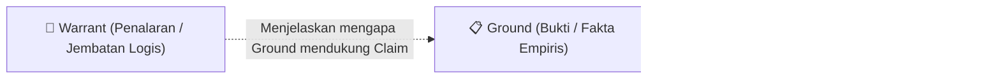
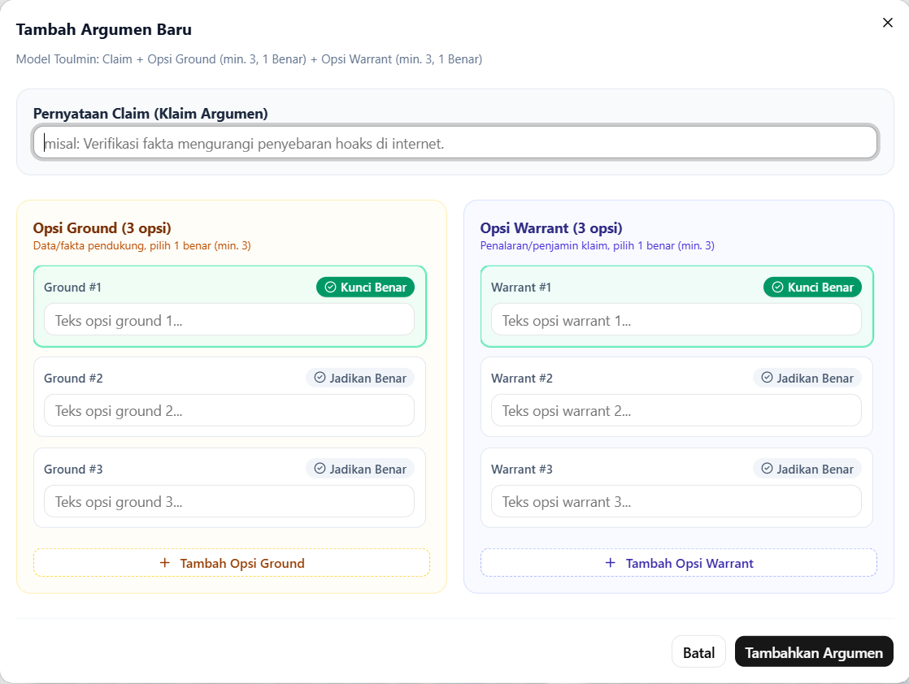
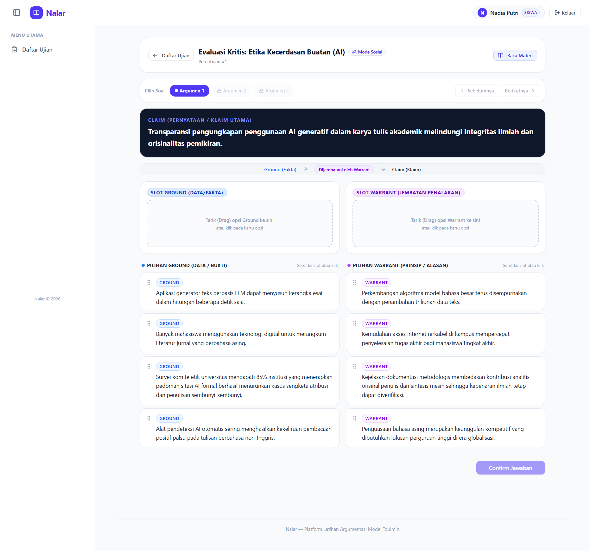
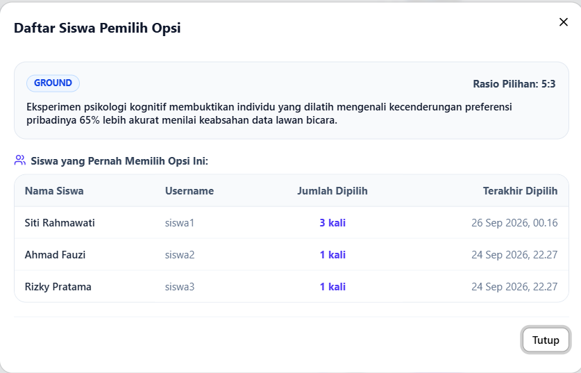
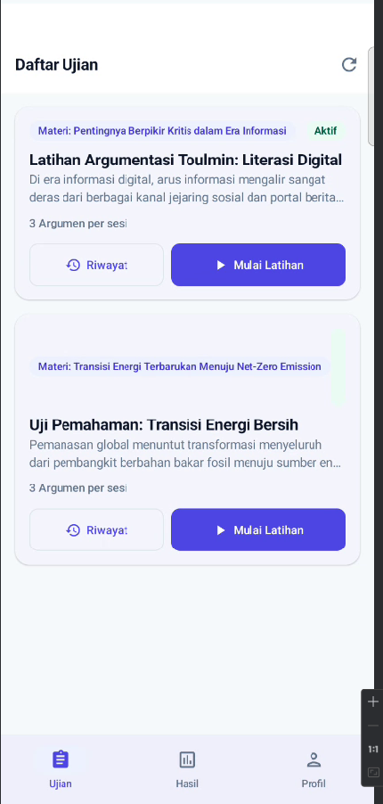
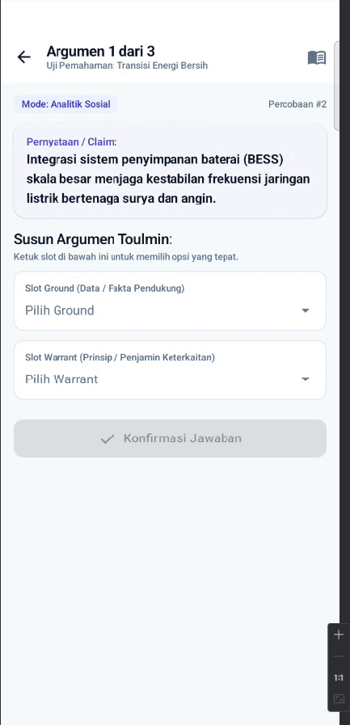
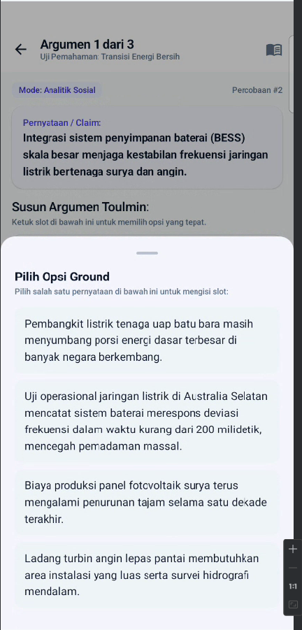
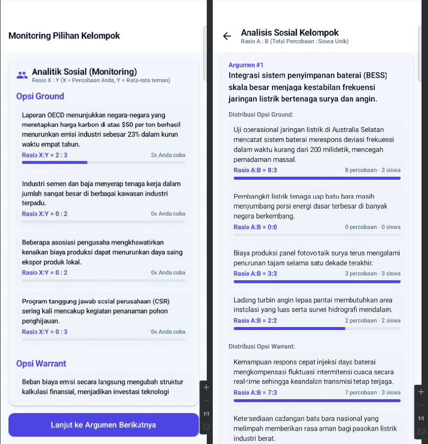

# 🧠 Nalar — Platform Latihan Argumentasi Berbasis Model Toulmin

**Nalar** `hard r` adalah platform pembelajaran interaktif (Web & Mobile Android) yang dirancang untuk membantu siswa memahami dan melatih cara menyusun struktur argumen yang logis dan kritis menggunakan **Model Argumentasi Toulmin (*Toulmin's Model of Argumentation*)**.

---

## 📌 Konteks Proyek & Disclaimer (Penting!)

Sebelum menjelajahi repositori ini, ada beberapa konteks penting mengenai latar belakang dan cara proyek ini dikembangkan:

1. **Terinspirasi dari Penelitian Skripsi (Versi Sangat Sederhana)**  
   Proyek ini terinspirasi dari aplikasi yang saya gunakan pada penelitian skripsi saya. Namun, versi di dalam repositori ini **dibuat sangat-sangat sederhana (*simplified*)** — baik dari sisi aturan domain, alur eksperimen, maupun instrumen pengukurannya — agar fokus pada fungsi inti latihan berargumen yang dapat digunakan secara riil di dunia nyata.
2. **Project-Based Learning & Eksplorasi Tech Stack**  
   Tujuan utama pembuatan ulang proyek ini adalah sebagai **portofolio** sekaligus media belajar (**project-based learning**) untuk mengeksplorasi *tech stack* modern melalui studi kasus aplikasi nyata:
   - 📱 **Mobile (`mobile/` — Kotlin Android):** Aplikasi asli pada penelitian skripsi saya **belum memiliki versi mobile**. Di proyek ini, saya membangun aplikasi Android dari nol sebagai portofolio sekaligus sarana belajar bahasa **Kotlin** dan ekosistem Android modern (*Jetpack Compose, Coroutines/StateFlow, Retrofit, DataStore*).
   - 🌐 **Web (`web/` — React SPA Tanpa Meta-Framework):** Ini adalah pertama kalinya saya membangun aplikasi **React secara mandiri tanpa *framework* terpadu** (seperti Next.js). Saya merakit dan mengonfigurasi sendiri dependensi yang dibutuhkan layaknya aplikasi produksi: *routing* (`@tanstack/react-router`), *server-state management* (`@tanstack/react-query`), *form & validation* (`react-hook-form` + `zod`), *drag-and-drop* (`@dnd-kit`), hingga komponen UI (`shadcn/ui` + Tailwind CSS).
   - ⚙️ **Backend (`backend/` — Go REST API):** Digunakan sebagai sarana belajar bahasa **Go (Golang)**, memahami arsitektur berlapis (*handler → service → repository*), pengelolaan autentikasi JWT, migrasi database, serta ekosistem library di dalamnya (`chi`, `GORM`, `bcrypt`).
3. **Dikembangkan dengan *Vibe Coding***  
   Dalam proses pengembangannya, proyek ini dikerjakan menggunakan pendekatan **vibe coding** (berkolaborasi dengan *AI coding agent*). Agar hasil *vibe coding* tetap terarah, konsisten, dan teruji, seluruh spesifikasi produk, aturan desain, arsitektur database, dan batasan library dikunci terlebih dahulu di dalam folder [`docs/`](./docs/README.md) (*spec-driven vibe coding*).

---

## 📖 Latar Belakang: Kerangka Dasar Argumentasi Toulmin

Banyak siswa mampu menyampaikan pendapat, namun sering kali kesulitan membedakan antara **klaim opini**, **bukti faktual**, dan **alasan logis** yang menghubungkan keduanya.

Secara teori, **Model Argumentasi Stephen Toulmin (1958)** memiliki **6 komponen lengkap**:
1. *Claim* (Pernyataan/Kesimpulan)
2. *Grounds / Data* (Bukti/Fakta)
3. *Warrant* (Penalaran/Jembatan Logis)
4. *Backing* (Dukungan tambahan atas Warrant)
5. *Modal Qualifier* (Batasan derajat kepastian)
6. *Rebuttal* (Pengecualian/Sanggahan)

Untuk kebutuhan latihan dasar yang ramah bagi siswa, **Nalar menyederhanakan model tersebut menjadi 3 elemen inti (*Toulmin Triad*)**:



- **Claim (Klaim):** Pernyataan atau kesimpulan utama yang disajikan oleh pengajar/asesor dari suatu bacaan.
- **Ground (Bukti/Data):** Fakta empiris, statistik, atau temuan dari materi bacaan yang menjadi fondasi klaim.
- **Warrant (Penalaran):** Asumsi atau prinsip logis yang menjembatani **mengapa** *Ground* tersebut relevan dan sah untuk mendukung *Claim*.

Dalam aplikasi ini, siswa membaca sebuah materi dan diberikan sebuah **Claim**, lalu bertugas memilih pasangan **Ground** dan **Warrant** yang tepat dari sejumlah opsi pengecoh (*distractor*).

---

## ✨ Fitur Utama

### 👥 1. Tiga Peran Pengguna (*Role-Based Access*)
- **Admin:** Mengelola akun asesor & siswa, kelas, materi bacaan, argumen, paket latihan/ujian, serta memantau seluruh hasil dan log percobaan.
- **Asesor (Guru/Pengajar):** Mengelola kelas miliknya sendiri, menyusun materi & soal argumen Toulmin, mengatur hak akses ujian, dan mengevaluasi log percobaan siswanya.
- **Siswa:** Mengakses paket latihan yang ditugaskan, mengerjakan penyusunan argumen (di Mobile maupun Web), serta melihat riwayat hasil dan analitik sosial.

### 🎮 2. Tiga Mode Belajar
Setiap kali memulai sesi latihan, siswa dapat memilih satu dari tiga mode pembelajaran:
| Mode | Deskripsi Perilaku |
|---|---|
| **Standar** | Siswa menyusun *Ground* dan *Warrant* lalu menekan *Confirm*. Sistem hanya memberi tahu apakah kombinasi sudah tepat atau belum tanpa membocorkan slot mana yang salah. |
| **Bantuan (*Scaffolding*)** | Jika jawaban belum tepat saat *Confirm*, sistem memberikan petunjuk spesifik bagian mana (*Ground* atau *Warrant*) yang sudah benar dan mana yang masih perlu diperbaiki. |
| **Analitik Sosial** | Mengadopsi konsep *Open Social Learner Modeling*: menampilkan perbandingan pilihan siswa dengan rekan sekelompok secara anonim melalui **Monitoring ($X:Y$)** di tiap soal dan **Analysis ($A:B$)** di akhir sesi. |

### 🔄 3. Interaksi Adaptif Lintas Platform (Web vs Mobile)
Walaupun berbagi *endpoint* backend yang sama, antarmuka pengerjaan disesuaikan dengan ergonomi masing-masing perangkat:
- **Web (Drag-and-Drop):** Siswa menyeret (*drag*) kartu opsi *Ground* dan *Warrant* ke dalam slot diagram Toulmin menggunakan `@dnd-kit`.
- **Mobile Android (Tap-to-Select):** Karena keterbatasan layar ponsel untuk teks panjang, siswa cukup mengetuk slot *Ground* atau *Warrant* untuk membuka `ModalBottomSheet` dan memilih opsi yang sesuai.

---

## 🖼️ Preview & Tampilan Aplikasi (Screenshots)

> 💡 **Catatan Portofolio:** Tempatkan tangkapan layar aplikasi di dalam folder `docs/screenshots/` dengan nama file di bawah ini agar gambar otomatis tampil di README.

### A. Tampilan Web (`web/`)
| Halaman | Preview | Apa yang Ditunjukkan |
|---|---|---|
| **1. Panel Asesor — Editor Argumen Toulmin** |  | Form pembuatan *Claim* beserta opsi *Ground* & *Warrant* dengan validasi `react-hook-form` + `zod`. |
| **2. Layar Latihan Siswa (Drag & Drop)** |  | Interaksi *drag-and-drop* kartu opsi ke slot *Ground* dan *Warrant* di sebelah teks materi bacaan. |
| **3. Dashboard Hasil & Log Analitik Staf** |  | Tabel riwayat sesi siswa, log urutan percobaan (*attempt logs*), dan rasio distribusi pilihan kelompok. |

### B. Tampilan Mobile Android (`mobile/`)
| Daftar Ujian & Pilih Mode | Layar Argumen (Tap-to-Select) | Bottom Sheet Opsi | Analitik Sosial ($X:Y$ & $A:B$) |
|---|---|---|---|
|  |  |  |  |
| Daftar paket latihan aktif & dialog pemilihan 3 mode belajar. | Susunan vertikal *Claim*, slot *Ground*, dan slot *Warrant*. | `ModalBottomSheet` Material 3 saat siswa mengetuk salah satu slot. | Tampilan perbandingan pilihan siswa dengan rata-rata kelompok. |

---

## 🛠️ Tech Stack & Eksplorasi Library

Seluruh keputusan pemilihan library dan aturan arsitektur didokumentasikan secara rinci di [`docs/05-tech-stack.md`](./docs/05-tech-stack.md).

### 1. Backend (`backend/`) — Belajar Go & Clean Layered Architecture
- **Bahasa:** Go `1.26`
- **HTTP Router:** [`go-chi/chi/v5`](https://github.com/go-chi/chi) — router ringan dan idiomatik yang kompatibel dengan `net/http` standar.
- **ORM & Database:** [`GORM`](https://gorm.io/) + driver PostgreSQL (`gorm.io/driver/postgres`).
- **Autentikasi & Keamanan:** JWT (`golang-jwt/jwt/v5`), password hashing (`golang.org/x/crypto/bcrypt`), dan *rate-limiting middleware* pada endpoint login.
- **Konfigurasi:** `joho/godotenv` untuk manajemen environment variabel lokal.
- **Pola Arsitektur:** Pemisahan ketat per domain (`user`, `class`, `material`, `exam`, `session`) menjadi `handler.go` (HTTP) → `service.go` (logika bisnis & unit test) → `repository.go` (akses database).

### 2. Web (`web/`) — Merakit Ekosistem React Tanpa Framework
- **Core & Bundler:** React 19 + TypeScript + Vite
- **Routing:** [`@tanstack/react-router`](https://tanstack.com/router) — *type-safe client-side routing* dengan *role guard* (Admin/Asesor vs Siswa).
- **State Management & Data Fetching:** [`@tanstack/react-query`](https://tanstack.com/query) — mengelola *caching*, sinkronisasi data API, dan mutasi terpusat.
- **Form & Validasi Skema:** [`react-hook-form`](https://react-hook-form.com/) + [`zod`](https://zod.dev/) (`@hookform/resolvers`) — validasi form deklaratif yang selaras dengan aturan server.
- **Interaksi Drag-and-Drop:** [`@dnd-kit/core`](https://dndkit.com/) & `@dnd-kit/sortable`.
- **UI Components & Styling:** [`shadcn/ui`](https://ui.shadcn.com/) (berbasis Radix UI) + **Tailwind CSS v4** + `lucide-react` + notifikasi toast `sonner`.

### 3. Mobile (`mobile/`) — Belajar Kotlin & Modern Android Development
- **Bahasa:** Kotlin
- **UI Toolkit:** **Jetpack Compose** dengan sistem desain **Material 3**.
- **Navigasi:** `androidx.navigation:navigation-compose`
- **Arsitektur & State:** `ViewModel` + Kotlin `Coroutines` + `StateFlow` (pola *unidirectional data flow*).
- **Networking:** `Retrofit2` + `Converter-Gson` + `OkHttp3` (dilengkapi *Auth Interceptor* untuk injeksi token Bearer otomatis).
- **Penyimpanan Lokal:** **Jetpack DataStore Preferences** (`androidx.datastore:datastore-preferences`) untuk menyimpan sesi token JWT secara asinkron.

---

## 📂 Struktur Direktori

```text
nalar/
├── backend/                  # Go REST API
│   ├── cmd/
│   │   ├── api/main.go       # Entrypoint server HTTP
│   │   └── seed/main.go      # Seeder data awal (akun, kelas, materi, sesi)
│   ├── internal/             # Modul domain (user, class, material, exam, session, db, middleware)
│   ├── migrations/           # File migrasi SQL (.up.sql & .down.sql)
│   └── .air.toml             # Konfigurasi Air untuk live-reload backend Go
├── web/                      # React Single Page Application (Vite + TS)
│   └── src/
│       ├── components/       # Komponen UI (shadcn/ui) & wrapper global
│       ├── features/         # Logika per domain (api.ts, types.ts, components/)
│       ├── lib/              # API client & TanStack Query client
│       └── routes/           # Definisi halaman TanStack Router (admin & student)
├── mobile/                   # Aplikasi Android Native (Kotlin + Jetpack Compose)
│   └── app/src/main/java/com/mulki/nalar/
│       ├── core/             # Retrofit ApiService, DTO, NetworkModule, TokenManager (DataStore)
│       ├── feature/          # Screen & ViewModel per fitur (auth, examlist, session, argument, result)
│       └── ui/theme/         # Konfigurasi warna, tipografi, dan tema Material 3
└── docs/                     # Dokumentasi spesifikasi produk & panduan AI agent
```

---

## 🚀 Cara Menjalankan Proyek Secara Lokal

### Prasyarat
- **PostgreSQL** (aktif dan memiliki satu database kosong, misal `nalar`)
- **Go** (versi `1.22+` / `1.26`)
- **Node.js** (versi `20+`) & `npm`
- **Android Studio** (untuk menjalankan modul `mobile/` di emulator atau perangkat fisik)

### 1. Menjalankan Backend (Go)
```bash
cd backend

# Salin file konfigurasi environment dan sesuaikan kredensial PostgreSQL Anda
cp .env.example .env

# Jalankan seeder untuk mengisi data awal (user, kelas, materi Toulmin, ujian, dan sampel analitik)
go run ./cmd/seed/main.go -fresh

# Opsi A: Jalankan server API menggunakan Air (Live Reload, konfigurasi sudah tersedia di .air.toml)
air

# Opsi B: Atau jalankan langsung menggunakan perintah Go standar (default: http://127.0.0.1:8080)
go run ./cmd/api/main.go
```

> 💡 **Tips:** Jika belum menginstal `air` untuk *live-reload* saat mengedit kode Go, Anda dapat menginstalnya dengan perintah:
> ```bash
> go install github.com/air-verse/air@latest
> ```

Untuk menjalankan unit test pada backend:
```bash
go test -v ./...
```

#### 🔑 Akun Demo (Hasil Seeder)
Seluruh akun demo menggunakan password: **`password123`**
| Peran | Username | Nama | Keterangan |
|---|---|---|---|
| **Admin** | `admin` | Super Admin | Akses penuh ke seluruh fitur manajemen & analitik |
| **Asesor** | `asesor1` | Budi Asesor, M.Pd. | Pemilik kelas X-A, XI-IPA, dan materi Literasi Digital & Energi |
| **Asesor** | `asesor2` | Dr. Dewi Lestari | Pemilik kelas XII-IPS dan materi Etika AI |
| **Siswa** | `siswa1` s/d `siswa5` | Siti, Ahmad, Rizky, Nadia, Fajar | Akun siswa untuk mencoba latihan di Mobile maupun Web |

### 2. Menjalankan Web (React)
```bash
cd web

# Instal dependensi
npm install

# Jalankan development server (default: http://localhost:5173)
npm run dev
```

### 3. Menjalankan Mobile (Kotlin Android)
Aplikasi Android (`mobile/`) dikonfigurasi di `NetworkModule.kt` untuk mengakses backend melalui `http://127.0.0.1:8080/api/v1/`. Agar perangkat Android (baik HP fisik via kabel USB maupun Emulator) dapat langsung menembus port `8080` di komputer tanpa terhalang *firewall* Wi-Fi, **wajib menjalankan `adb reverse` terlebih dahulu**:

1. Buka folder `mobile/` menggunakan **Android Studio** dan pastikan HP fisik (*USB Debugging* aktif) atau Emulator Android sudah terhubung/menyala.
2. Jalankan perintah *port forwarding* `adb reverse` di terminal:
   ```bash
   # Jika adb sudah terdaftar di PATH sistem:
   adb reverse tcp:8080 tcp:8080
   ```
   ```powershell
   # Atau di Windows PowerShell menggunakan lokasi default Android SDK:
   & "$env:LOCALAPPDATA\Android\Sdk\platform-tools\adb.exe" reverse tcp:8080 tcp:8080
   ```
3. Pastikan backend Go sudah berjalan di port `8080`.
4. Klik **Run (`app`)** di Android Studio, lalu masuk menggunakan salah satu akun siswa (contoh: `siswa1` / `password123`).

---

## 📚 Peta Dokumentasi (`docs/`)

Seluruh rancangan produk dan keputusan teknis yang memandu proses *vibe coding* proyek ini tersimpan di dalam folder [`docs/`](./docs/README.md):

- [`01-product.md`](./docs/01-product.md) — Ringkasan produk, peran pengguna, glosarium domain, daftar fitur (`F-01` s/d `F-17`), dan aturan 3 mode belajar.
- [`02-flows.md`](./docs/02-flows.md) — Alur pengerjaan siswa (Web Drag-and-Drop vs Mobile Tap-to-Select) dan rumus perhitungan Analitik Sosial ($X:Y$ & $A:B$).
- [`03-architecture.md`](./docs/03-architecture.md) — Diagram ERD database, constraint tabel, dan ringkasan kontrak endpoint REST API (`/api/v1`).
- [`04-rules-design.md`](./docs/04-rules-design.md) — Aturan non-fungsional, asumsi domain, serta Design System (palet warna, tipografi, dan tata letak).
- [`05-tech-stack.md`](./docs/05-tech-stack.md) — Daftar library terkunci dan aturan arsitektur folder di Backend, Web, dan Mobile.
- [`06-tasks.md`](./docs/06-tasks.md) — Rencana tahapan implementasi dan *Definition of Done* (kriteria penerimaan).
- [`07-progress-log.md`](./docs/07-progress-log.md) — Catatan riwayat implementasi fitur dan pengujian.