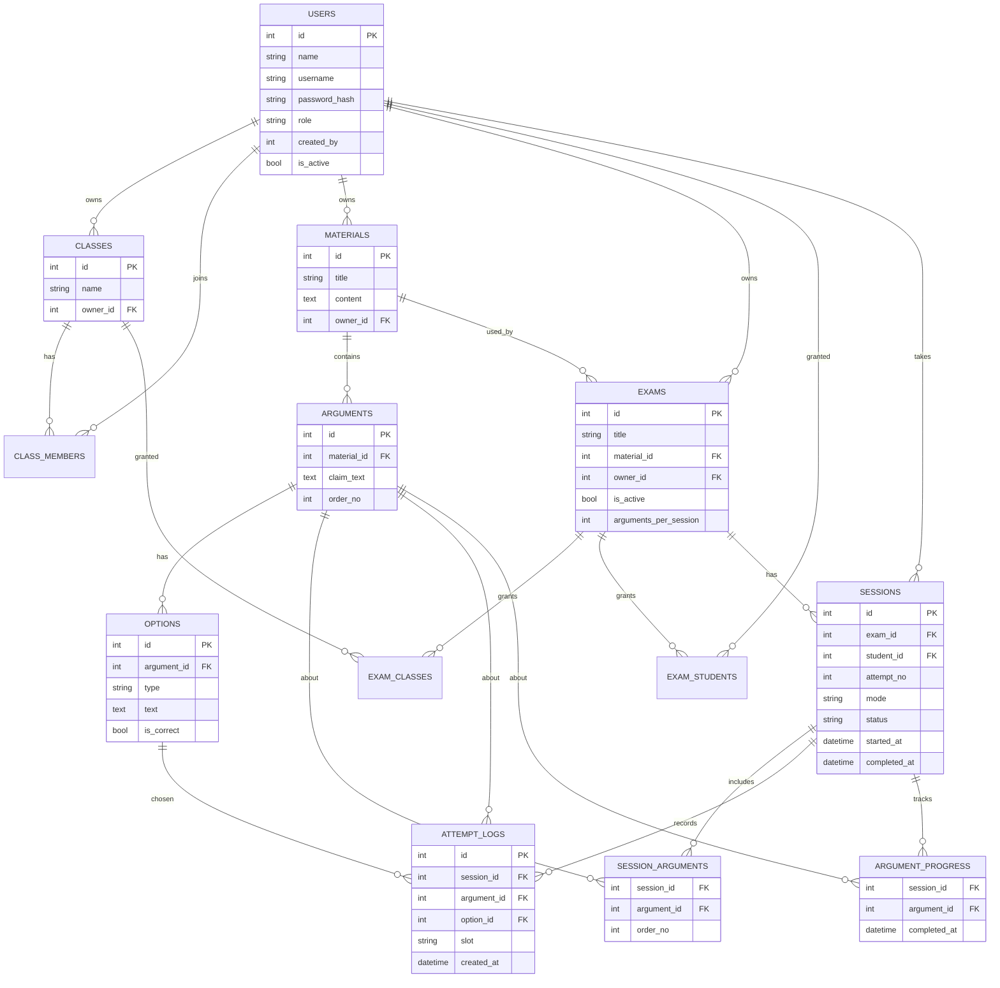

# 03. Architecture — Model Data & API

Prasyarat: `01-product.md` Bagian A untuk istilah domain.

## 1. Model data

## 2. Constraint penting

- `options.type` dan `attempt_logs.slot` bernilai `ground` atau `warrant`, dan harus sama.
- Satu argumen: tepat 4 opsi ground dan 4 warrant, masing-masing tepat 1 `is_correct = true`.
- `sessions`: maksimal **satu baris dengan `status = 'in_progress'`** per (`exam_id`, `student_id`); sesi baru hanya dibuat kalau tidak ada baris `in_progress` untuk pasangan itu. `attempt_no` naik otomatis per (`exam_id`, `student_id`).
- `session_arguments`: unik pada (`session_id`, `argument_id`); jumlah baris per sesi ≤ `exams.arguments_per_session`; ditulis sekali saat sesi dibuat dan tidak berubah selama sesi itu berjalan.
- `argument_progress`: unik pada (`session_id`, `argument_id`); `argument_id` harus ada di `session_arguments` sesi yang sama.
- `attempt_logs` hanya bertambah (append-only).

> Constraint di atas sebaiknya ditegakkan di level database (unique index, foreign key, check constraint) sebisa mungkin — bukan hanya divalidasi di kode Go — sesuai kriteria penerimaan #14 di `06-tasks.md`.

## 3. Ringkasan API (prefix `/api/v1`)

| Grup | Endpoint | Akses |
|---|---|---|
| Auth | `POST /auth/login`, `GET /auth/me` | Semua |
| Pengguna | `GET/POST /users`, `PATCH /users/:id` | Admin, asesor (terbatas) |
| Kelas | `CRUD /classes`, `POST/DELETE /classes/:id/members` | Admin, asesor |
| Materi | `CRUD /materials`, `CRUD /materials/:id/arguments` (dengan opsi) | Admin, asesor |
| Ujian | `CRUD /exams`, `PUT /exams/:id/access`, `PATCH /exams/:id/status` | Admin, asesor |
| Siswa | `GET /my/exams`, `GET /exams/:id/session-status`, `POST /exams/:id/start`, `GET /sessions/:id` | Siswa |
| Siswa | `POST /sessions/:id/arguments/:aid/drops`, `POST /sessions/:id/arguments/:aid/confirm` | Siswa |
| Siswa | `GET /sessions/:id/analysis`, `GET /my/exams/:id/sessions` | Siswa |
| Staf | `GET /exams/:id/results`, `GET /exams/:id/logs`, `GET /exams/:id/analysis` | Admin, asesor |

Endpoint `drops` dan `confirm` di atas dipakai oleh **web dan mobile dengan payload yang sama** — lihat `02-flows.md` §1 langkah 5 untuk perbedaan interaksi UI yang memicunya.

Body `confirm` membawa `ground_option_id` dan `warrant_option_id`. Server memvalidasi bahwa kedua opsi milik argumen tersebut.

### Detail alur mulai/lanjut sesi

- `GET /exams/:id/session-status` mengembalikan apakah ada sesi `in_progress` milik siswa pada ujian itu, beserta `mode`-nya. Klien memanggil ini sebelum menampilkan pilihan mode, untuk menentukan apakah perlu menampilkan dialog konfirmasi ganti mode.
- `POST /exams/:id/start` menerima `{ mode, confirm_mode_change: bool }`.
  - Tidak ada sesi `in_progress` → buat sesi baru, pilih subset argumen acak, kembalikan sesi dan argumen pertama.
  - Ada sesi `in_progress` dengan mode sama → lanjutkan sesi itu, kembalikan argumen pertama yang belum selesai.
  - Ada sesi `in_progress` dengan mode berbeda dan `confirm_mode_change = false` → kembalikan `409` beserta mode sesi berjalan, supaya klien menampilkan dialog konfirmasi.
  - Ada sesi `in_progress` dengan mode berbeda dan `confirm_mode_change = true` → perbarui `sessions.mode`, lanjutkan sesi itu.
- `GET /my/exams/:id/sessions` mengembalikan riwayat seluruh sesi (percobaan) siswa pada ujian itu.
