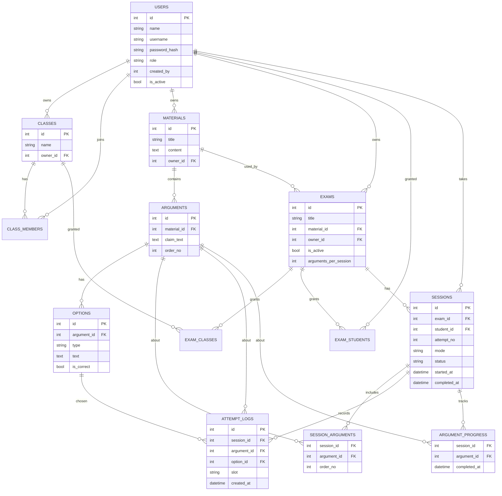

# PRD: Nalar (Rebuild Viat Map) — ARSIP

> **Dokumen ini sudah dipecah** menjadi beberapa file fokus di folder `docs/` (`01-overview.md` s/d `06-tasks.md`, dengan `docs/README.md` sebagai peta). Gunakan file-file di `docs/` sebagai sumber kebenaran saat memberi instruksi ke agent coding; simpan file ini hanya sebagai arsip riwayat versi awal.

Versi 1.0.

## 1. Ringkasan

Nalar adalah platform **latihan argumentasi berbasis model Toulmin**. Asesor menyusun materi bacaan beserta argumen (claim). Siswa menyusun argumen dengan memilih *ground* dan *warrant* yang tepat untuk sebuah *claim* (drag and drop di web, tap-to-select di mobile — lihat bagian 6). Sistem mencatat setiap percobaan memilih opsi, lalu menampilkan hasil dan perbandingan pilihan antarsiswa secara anonim (analitik sosial).

Ini **latihan belajar, bukan ujian formal**. Tidak ada nilai numerik atau timer. Siswa boleh mengerjakan ujian yang sama berkali-kali sebagai latihan, dan setiap percobaan mengambil subset argumen secara acak (maksimal 3) dari materi. Siswa lanjut ke argumen berikutnya setelah menemukan jawaban yang benar. Kata "ujian" tetap dipakai sebagai istilah untuk satu paket latihan yang diberikan ke siswa.

## 2. Tujuan dan non-tujuan

**Tujuan**
- Siswa dapat menyelesaikan satu sesi latihan penuh dari HP (Android).
- Admin dan asesor dapat melihat siapa memilih opsi apa, dan berapa kali.
- Repo portofolio yang menunjukkan web + mobile + backend, dengan test untuk logika inti.

**Non-tujuan (versi ini)**
Tipe ujian, konsep eksperimen (kontrol/perlakuan, pre/post), adaptive learning, kategori peserta, skor perilaku (steps/waktu), timer, nilai numerik/ranking antar percobaan, gamifikasi, chatbot/AI, deteksi ekspresi wajah, deploy, Docker, mode offline, multi-bahasa.

## 3. Peran dan hak akses

| Kemampuan | Admin | Asesor | Siswa |
|---|---|---|---|
| Kelola akun asesor | Ya | - | - |
| Buat akun siswa | Ya | Ya | - |
| Ubah/nonaktifkan akun siswa | Semua | Yang ia buat | - |
| Kelola kelas dan anggota kelas | Semua | Milik sendiri | - |
| Kelola materi dan argumen | Semua | Milik sendiri | - |
| Kelola ujian (materi, status, akses) | Semua | Milik sendiri | - |
| Lihat hasil dan log dengan identitas | Semua | Ujian miliknya | - |
| Lihat daftar ujian yang boleh diakses | - | - | Ya |
| Mengerjakan ujian | - | - | Ya |
| Lihat hasil sendiri dan analitik sosial anonim | - | - | Ya |

Satu siswa boleh menjadi anggota banyak kelas.

## 4. Konsep domain

- **Material:** bacaan/topik. Memiliki beberapa Argument yang berurutan.
- **Argument:** satu *claim* + **4 opsi ground** + **4 opsi warrant**. Tepat 1 ground benar dan 1 warrant benar.
- **Class:** kelompok siswa yang dimiliki satu asesor/admin.
- **Exam:** menghubungkan satu Material dengan status aktif/nonaktif, daftar akses (kelas dan/atau siswa individu), dan `arguments_per_session` (default 3, jumlah maksimum argumen yang diambil secara acak dari materi untuk satu sesi).
- **Session:** satu **percobaan** siswa pada satu ujian. Siswa boleh membuat banyak sesi (belajar berkali-kali). Setiap sesi menyimpan subset argumen (maksimal 3, diacak) yang tetap sepanjang sesi itu, dan mode belajar yang dipilih. Hanya boleh ada **satu sesi berstatus berjalan** per (siswa, ujian) pada satu waktu; sesi baru hanya dibuat setelah sesi sebelumnya berstatus selesai.
- **Session argument:** daftar argumen yang terpilih untuk satu sesi, beserta urutannya. Ditentukan sekali saat sesi dibuat dan tidak berubah meski sesi dilanjutkan nanti.
- **Attempt log:** satu catatan setiap siswa men-*drop* sebuah opsi ke slot jawaban.
- **Argument progress:** penanda argumen (dalam ruang lingkup sesi tertentu) yang sudah dijawab benar.

## 5. Fitur dan prioritas

| ID | Fitur | Prioritas | Platform |
|---|---|---|---|
| F-01 | Login/logout, role-based access | Must | Semua |
| F-02 | Admin kelola asesor; admin/asesor buat siswa | Must | Web |
| F-03 | CRUD kelas dan anggota kelas | Must | Web |
| F-04 | CRUD materi dan argumen (claim + 4 ground + 4 warrant, validasi) | Must | Web |
| F-05 | CRUD ujian: pilih materi, aktif/nonaktif, atur akses kelas/siswa, atur `arguments_per_session` | Must | Web |
| F-06 | Siswa melihat daftar ujian yang boleh diakses | Must | Mobile |
| F-07 | Siswa memilih mode, lalu server membuat sesi baru (subset argumen acak) atau melanjutkan sesi berjalan | Must | Mobile + backend |
| F-08 | Pengerjaan: baca materi, susun argumen dengan tap-to-select (ketuk slot → pilih opsi di bottom sheet), Confirm, lanjut setelah benar | Must | Mobile |
| F-09 | Pencatatan log setiap drop | Must | Backend |
| F-10 | Sesi berjalan bisa dilanjutkan setelah keluar/gangguan jaringan, termasuk konfirmasi jika mode belajar diubah | Must | Mobile + backend |
| F-11 | Mode standar, bantuan, dan analitik sosial | Must | Mobile + backend |
| F-12 | Hasil sendiri untuk siswa; hasil semua siswa untuk admin/asesor | Must | Mobile + web |
| F-13 | Log percobaan dengan identitas untuk admin/asesor | Must | Web |
| F-14 | Siswa mengerjakan lewat web (reuse API yang sama) | Should | Web |
| F-15 | Urutan opsi diacak, stabil per sesi | Should | Backend |
| F-16 | Ekspor hasil/log ke CSV | Should | Web |
| F-17 | Impor siswa lewat CSV, mode gelap | Could | Web |

## 6. Alur dan aturan pengerjaan

1. Siswa membuka daftar ujian. Hanya ujian **aktif** yang siswa akses lewat kelasnya atau penugasan individu yang muncul.
2. Siswa menekan sebuah ujian. Server memeriksa apakah siswa punya **sesi berstatus berjalan** pada ujian itu:
   - **Tidak ada** (belum pernah, atau semua sesi sebelumnya sudah selesai): siswa memilih mode (bagian 7), lalu server membuat sesi baru, mengambil maksimal 3 argumen secara acak dari materi (`arguments_per_session`), dan menyimpannya sebagai session argument dengan urutan tetap.
   - **Ada sesi berjalan**: siswa tetap diminta memilih mode.
     - Jika mode yang dipilih **sama** dengan mode sesi berjalan: langsung lanjutkan ke argumen pertama yang belum selesai. Riwayat argumen yang sudah dijawab benar pada sesi itu tidak hilang, dan subset argumennya tidak diacak ulang.
     - Jika mode yang dipilih **berbeda**: tampilkan konfirmasi "mode belajar akan diubah dari X ke Y, lanjutkan sesi ini?". Jika dikonfirmasi, `sessions.mode` diperbarui dan siswa melanjutkan ke argumen yang belum selesai (subset argumen tetap sama, progres tetap sama). Jika dibatalkan, siswa tetap di halaman daftar ujian.
3. Siswa membaca materi, lalu masuk ke argumen pertama yang belum selesai pada sesi itu.
4. Layar argumen, dengan indikator "Argumen X dari N" mengacu ke posisi dalam session argument (N maksimal 3). Tata letak dan interaksi **berbeda per platform**, tapi keduanya memanggil endpoint drop/confirm yang sama (lihat bagian 9):

   **4a. Web (mengikuti desain lama, drag and drop)**
   - Claim di bagian atas.
   - Slot **Ground** di kiri dan slot **Warrant** di kanan. Satu panah dari ground ke claim, dan satu panah dari warrant yang menunjuk ke panah tersebut (warrant menjembatani ground dan claim).
   - Daftar opsi ground dan warrant di bawah slot masing-masing, masing-masing 4 opsi.
   - Tombol **Confirm**, aktif jika kedua slot terisi.

   **4b. Mobile (tap-to-select, bukan drag and drop)**
   - Claim di bagian atas.
   - Slot **Ground** dan slot **Warrant** ditampilkan sebagai dua kartu kosong tersusun vertikal (ground lalu warrant), dengan placeholder "Pilih Ground" / "Pilih Warrant" saat kosong. Panah/diagram penghubung ground-warrant-claim pada desain lama **tidak dipakai** di mobile karena ruang layar terbatas.
   - Daftar 4 opsi ground dan 4 opsi warrant **tidak ditampilkan langsung di layar**; opsi baru muncul saat slot terkait ditekan.
   - Tombol **Confirm**, aktif jika kedua slot terisi.
5. Siswa mengisi slot, mekanismenya berbeda per platform:
   - **Web:** siswa men-*drop* opsi ke slot. Opsi ground hanya bisa ke slot ground, dan opsi warrant hanya ke slot warrant (divalidasi di klien dan server).
   - **Mobile:** siswa menekan slot yang masih kosong. Menekan slot Ground membuka lembar pilihan (bottom sheet) berisi 4 opsi ground argumen tersebut; menekan slot Warrant membuka lembar berisi 4 opsi warrant. Siswa memilih satu opsi pada lembar tersebut, lembar tertutup, dan opsi itu mengisi slot. Slot yang sudah terisi tetap bisa ditekan ulang untuk membuka lembar pilihan dan mengganti isinya.
   - Di kedua platform, setiap pengisian/penggantian slot dicatat sebagai satu **attempt log** (payload dan endpoint sama; istilah "drop" pada data/API tetap dipakai sebagai konsep, terlepas dari interaksi UI-nya berupa seret atau ketuk-pilih). Mengganti isi slot dengan opsi lain dicatat sebagai drop baru.
6. Tekan **Confirm**. Server menilai:
   - Ground dan warrant benar: argumen ditandai selesai (argument progress), argumen berikutnya dalam session argument terbuka.
   - Salah satu atau keduanya salah: siswa diberi tahu belum tepat (detail sesuai mode) dan boleh mencoba lagi tanpa batas.
7. Setelah argumen terakhir dalam sesi itu selesai, sesi berstatus **selesai** dan siswa melihat ringkasan hasil. Siswa bisa memulai sesi baru (percobaan baru) kapan pun, dengan subset argumen yang baru diacak.
8. Kebenaran jawaban **selalu dinilai di server**. Field `is_correct` tidak dikirim ke klien kecuali sesuai aturan mode.
9. Timer pada desain lama dihapus.
10. Jika koneksi putus atau aplikasi ditutup di tengah sesi, status sesi tetap **berjalan** dan mengikuti aturan poin 2 saat diakses kembali.

## 7. Mode belajar

| Mode | Perilaku |
|---|---|
| **Standar** | Siswa tidak diberi tahu mana opsi yang benar atau salah, kecuali hasil Confirm (benar/belum tepat). |
| **Bantuan** | Siswa mengetahui bagian mana yang salah dan benar (lihat asumsi A3). |
| **Analitik sosial** | Perilaku seperti standar, ditambah tampilan perbandingan pilihan kelompok (bagian 8). |

Siswa memilih salah satu dari ketiganya setiap kali menekan sebuah ujian. Untuk sesi baru, mode itu langsung berlaku. Untuk sesi yang sedang berjalan, mode lama tetap dipakai kecuali siswa memilih mode lain dan mengonfirmasi perubahannya (lihat bagian 6, langkah 2).

## 8. Log dan analitik sosial

### 8.1 Definisi dasar
- **Percobaan (attempt):** satu kali opsi di-drop ke slot. Satu baris di `attempt_logs`.
- **Kelompok pembanding:** semua siswa yang memiliki minimal satu sesi pada ujian yang sama.
- Perhitungan **X** (percobaan siswa sendiri) dan agregat kelompok menggabungkan attempt log dari **seluruh sesi** siswa pada ujian itu, bukan hanya sesi yang sedang berjalan (lihat asumsi A8).
- Perhitungan dilakukan di backend per ujian, per argumen, per opsi.

### 8.2 Tampilan Monitoring (setiap argumen selesai, mode analitik sosial)
Untuk setiap opsi (4 ground dan 4 warrant), tampilkan **X : Y**.

- `X` = jumlah percobaan siswa itu sendiri pada opsi tersebut.
- `Y` = rata-rata percobaan per siswa yang memilih opsi tersebut.

```text
Y = round(total_percobaan_semua_siswa_pada_opsi / jumlah_siswa_unik_yang_memilih_opsi)
```

Contoh: opsi dipilih 3 siswa dengan percobaan 2, 3, dan 4. Total 9, siswa unik 3, sehingga Y = 3. Siswa yang memilih 2 kali melihat **2:3**.

`Y` bukan rata-rata seluruh siswa di kelas, karena penyebutnya hanya siswa unik yang pernah memilih opsi tersebut. Pembulatan mengikuti sistem lama (setengah dibulatkan menjauhi nol, setara `math.Round` di Go).

### 8.3 Tampilan Analysis (setelah semua argumen selesai, mode analitik sosial)
Untuk setiap opsi pada setiap argumen, tampilkan **A : B**.

- `A` = total percobaan seluruh kelompok pada opsi tersebut.
- `B` = jumlah siswa unik yang pernah memilih opsi tersebut.

Contoh: **9:4** berarti opsi dipilih total 9 kali oleh 4 siswa berbeda.

| Tampilan | Angka pertama | Angka kedua |
|---|---|---|
| Monitoring | Percobaan siswa sendiri (X) | Rata-rata percobaan siswa pemilih (Y) |
| Analysis | Total percobaan kelompok (A) | Jumlah siswa unik pemilih (B) |

### 8.4 Aturan tambahan
- Jika tidak ada siswa yang memilih opsi, `Y` ditampilkan `-` (hindari pembagian nol).
- **Anonimitas:** data kelompok hanya tampil ke siswa jika jumlah siswa dengan sesi pada ujian itu >= `MIN_PEERS` (default 3, dapat dikonfigurasi). Identitas siswa lain tidak pernah dikirim ke klien siswa.
- Tampilan admin/asesor memakai data yang sama, tetapi menampilkan **nama siswa** dan rincian percobaan per siswa.
- Sebaiknya UI juga menampilkan bar distribusi selain angka rasio.

## 9. Hasil

Tidak ada nilai numerik. Karena satu siswa boleh punya banyak sesi (percobaan) pada satu ujian, hasil sesi berisi:
- Nomor percobaan, status (berjalan/selesai), mode yang dipakai, dan jumlah argumen selesai dari total pada sesi itu.
- Per argumen (dalam sesi itu): total percobaan dan penanda **tanpa salah** (selesai dengan tepat 2 percobaan, yaitu 1 ground dan 1 warrant).
- Total percobaan seluruh sesi itu.

Siswa melihat **riwayat semua sesinya** pada suatu ujian (daftar percobaan dan hasil masing-masing). Admin/asesor melihat tabel seluruh siswa per ujian, dengan seluruh sesi tiap siswa, dan detailnya dapat dibuka per sesi (opsi mana dipilih, urutan, jumlah, waktu pencatatan).

## 10. Model data



**Constraint penting**
- `options.type` dan `attempt_logs.slot` bernilai `ground` atau `warrant`, dan harus sama.
- Satu argumen: tepat 4 opsi ground dan 4 warrant, masing-masing tepat 1 `is_correct = true`.
- `sessions`: maksimal **satu baris dengan `status = 'in_progress'`** per (`exam_id`, `student_id`); sesi baru hanya dibuat kalau tidak ada baris `in_progress` untuk pasangan itu. `attempt_no` naik otomatis per (`exam_id`, `student_id`).
- `session_arguments`: unik pada (`session_id`, `argument_id`); jumlah baris per sesi ≤ `exams.arguments_per_session`; ditulis sekali saat sesi dibuat dan tidak berubah selama sesi itu berjalan.
- `argument_progress`: unik pada (`session_id`, `argument_id`); `argument_id` harus ada di `session_arguments` sesi yang sama.
- `attempt_logs` hanya bertambah (append-only).

## 11. Ringkasan API (prefix `/api/v1`)

| Grup | Endpoint | Akses |
|---|---|---|
| Auth | `POST /auth/login`, `GET /auth/me` | Semua |
| Pengguna | `GET/POST /users`, `PATCH /users/:id` | Admin, asesor (terbatas) |
| Kelas | `CRUD /classes`, `POST/DELETE /classes/:id/members` | Admin, asesor |
| Materi | `CRUD /materials`, `CRUD /materials/:id/arguments` (dengan opsi) | Admin, asesor |
| Ujian | `CRUD /exams`, `PUT /exams/:id/access`, `PATCH /exams/:id/status` | Admin, asesor |
| Siswa | `GET /my/exams`, `GET /exams/:id/session-status`, `POST /exams/:id/start`, `GET /sessions/:id` | Siswa |
| Siswa | `POST /sessions/:id/arguments/:aid/drops`, `POST /sessions/:id/arguments/:aid/confirm` | Siswa |
| Siswa | `GET /sessions/:id/analysis`, `GET /my/exams/:id/sessions` | Siswa |
| Staf | `GET /exams/:id/results`, `GET /exams/:id/logs`, `GET /exams/:id/analysis` | Admin, asesor |

Body `confirm` membawa `ground_option_id` dan `warrant_option_id`. Server memvalidasi bahwa kedua opsi milik argumen tersebut.

**Detail alur mulai/lanjut sesi:**
- `GET /exams/:id/session-status` mengembalikan apakah ada sesi `in_progress` milik siswa pada ujian itu, beserta `mode`-nya. Klien memanggil ini sebelum menampilkan pilihan mode, untuk menentukan apakah perlu menampilkan dialog konfirmasi ganti mode.
- `POST /exams/:id/start` menerima `{ mode, confirm_mode_change: bool }`.
  - Tidak ada sesi `in_progress` → buat sesi baru, pilih subset argumen acak, kembalikan sesi dan argumen pertama.
  - Ada sesi `in_progress` dengan mode sama → lanjutkan sesi itu, kembalikan argumen pertama yang belum selesai.
  - Ada sesi `in_progress` dengan mode berbeda dan `confirm_mode_change = false` → kembalikan `409` beserta mode sesi berjalan, supaya klien menampilkan dialog konfirmasi.
  - Ada sesi `in_progress` dengan mode berbeda dan `confirm_mode_change = true` → perbarui `sessions.mode`, lanjutkan sesi itu.
- `GET /my/exams/:id/sessions` mengembalikan riwayat seluruh sesi (percobaan) siswa pada ujian itu.

## 12. Persyaratan non-fungsional

- **Keamanan:** password di-hash (bcrypt/argon2), token dengan claim role, otorisasi diperiksa di server untuk setiap endpoint (termasuk kepemilikan data asesor), rate limiting pada login.
- **Privasi:** data seminimal mungkin. Tampilkan pemberitahuan bahwa pilihan siswa dicatat, dan identitas hanya terlihat oleh admin/asesor.
- **Keandalan:** drop dan confirm tidak boleh hilang saat koneksi putus sesaat (retry/antrian sederhana di klien).
- **UX mobile:** interaksi utama adalah **ketuk slot → pilih opsi di bottom sheet** (bukan drag and drop; lihat bagian 6.4b), untuk menghindari kerumitan implementasi drag-and-drop custom di Android serta keterbatasan lebar layar untuk teks ground/warrant yang panjang. Area sentuh minimal 48dp.
- **Kualitas:** dokumentasi API (OpenAPI), README dengan diagram arsitektur dan screenshot, seed data yang bisa dijalankan dengan satu perintah.
- **Tanpa Docker/deploy:** semua bisa dijalankan lokal dengan setup minimal.

## 13. Rencana 2-3 hari

| Hari | Fokus | Hasil |
|---|---|---|
| 1 | Backend | Auth + role, CRUD kelas/materi/ujian, endpoint pengerjaan (drop, confirm, progress), query analitik, seed data, unit test |
| 2 | Web admin/asesor | Login, kelola user/kelas/materi/ujian, tabel hasil, log dengan identitas, analitik sosial versi staf |
| 3 | Mobile siswa + polish | Login, daftar ujian, pilih mode, layar drag and drop, hasil, analitik sosial; README dan screenshot |

**Jika waktu mepet, potong dalam urutan ini:** F-17, F-16, F-15, F-14, tampilan detail per siswa di F-12. Fitur F-01 sampai F-13 adalah inti demo.

## 14. Asumsi (bisa diubah)

- **A1.** Kelompok pembanding = semua siswa dengan sesi pada ujian yang sama (bukan per kelas), karena satu ujian bisa diberikan ke beberapa kelas atau siswa individu.
- **A2.** Semua 4 opsi per jenis ditampilkan (sistem lama menampilkan 3 secara default). Jumlah tampil bisa dijadikan pengaturan nanti.
- **A3.** Mode bantuan: setelah Confirm, siswa melihat bagian mana (ground/warrant) yang benar dan yang salah. Alternatif: opsi salah ditandai sejak awal.
- **A4.** Mode dipilih siswa setiap kali mengakses ujian. Untuk sesi berjalan, mode lama tetap dipakai kecuali siswa memilih mode lain dan mengonfirmasinya secara eksplisit (bagian 6 dan 11).
- **A5.** Asesor hanya melihat kelas, materi, ujian, dan siswa yang berada di kelasnya.
- **A6.** Melepas opsi kembali ke daftar (web) atau menutup bottom sheet tanpa memilih (mobile) tidak dicatat. Hanya opsi yang benar-benar mengisi slot yang dicatat sebagai drop.
- **A7.** Tidak ada nilai numerik. "Hasil" berarti kemajuan penyelesaian dan jumlah percobaan, per sesi (percobaan).
- **A8.** Materi harus punya argumen lebih dari `arguments_per_session` agar pengacakan bermakna; jika materi punya argumen ≤ `arguments_per_session`, semua argumen dipakai. Pemilihan argumen tiap sesi baru diacak independen (boleh terulang dari sesi sebelumnya, tidak dijamin argumen berbeda).
- **A9.** Perhitungan X/Y/A/B pada analitik sosial (bagian 8) menggabungkan attempt log dari **semua sesi** siswa pada ujian itu (bukan hanya sesi aktif), karena sifatnya latihan berulang. Kalau maksudnya per sesi saja, beri tahu saya untuk diubah.

## 15. Kriteria penerimaan (contoh)

1. Asesor tidak bisa melihat/mengubah kelas, materi, atau ujian milik asesor lain (diuji otomatis).
2. Membuat argumen dengan jumlah opsi bukan 4+4, atau jumlah jawaban benar bukan 1+1, ditolak dengan pesan jelas.
3. Siswa yang tidak terdaftar pada ujian, atau ujian nonaktif, mendapat 403/404.
4. Respons klien siswa pada mode standar tidak berisi `is_correct`.
5. Siswa tidak dapat membuka argumen ke-N sebelum argumen ke-(N-1) selesai **dalam sesi yang sama**.
6. Setiap drop menambah tepat satu baris `attempt_logs`.
7. Untuk data 2, 3, 4 percobaan: monitoring menampilkan `2:3`, `3:3`, `4:3` (test unit fungsi rasio).
8. Untuk total 9 percobaan oleh 4 siswa unik: analysis menampilkan `9:4`.
9. Opsi yang belum dipilih siapa pun menampilkan `Y = -` tanpa error.
10. Data kelompok tidak tampil ke siswa jika jumlah siswa pada ujian < `MIN_PEERS`.
11. Siswa yang menyelesaikan sesi lalu menekan ujian yang sama mendapat sesi baru dengan `attempt_no` bertambah, dan subset argumen dipilih ulang secara acak.
12. Siswa dengan sesi `in_progress` yang memilih mode sama langsung dilanjutkan ke argumen belum selesai, tanpa dialog konfirmasi, dan tanpa argumen yang sudah selesai diulang.
13. Siswa dengan sesi `in_progress` yang memilih mode berbeda dan belum mengonfirmasi mendapat status `409` beserta mode sesi berjalan; setelah konfirmasi, `sessions.mode` berubah dan progres tetap.
14. Tidak mungkin ada dua sesi berstatus `in_progress` untuk (siswa, ujian) yang sama pada waktu bersamaan (diuji dengan constraint/index unik parsial atau setara).
